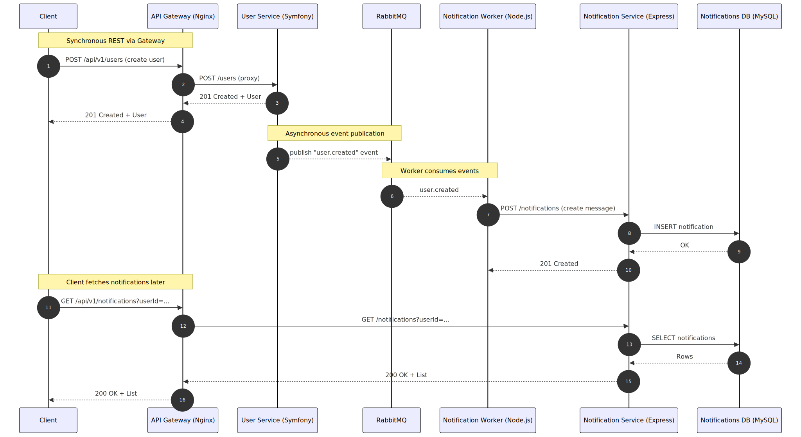
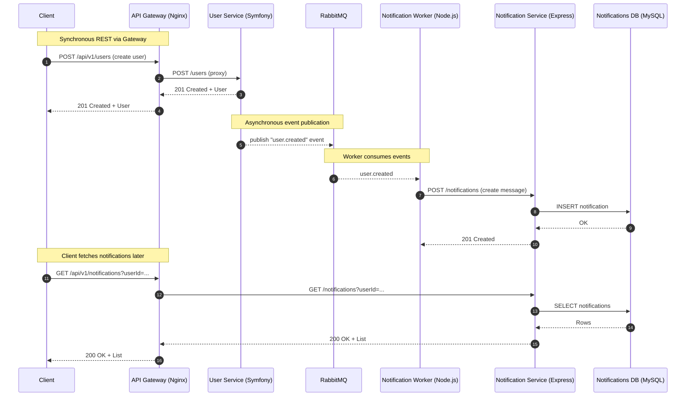

# 🏗️ Microservices Architecture

> **Production-ready microservices architecture demonstrating modern software engineering practices**


[](https://github.com/slimenmohamed/microservices-architecture/actions/workflows/ci.yml)
[• smoke script](scripts/smoke.sh) · [• e2e script](scripts/e2e.sh)

[](docs/user-service.openapi.json)
[](docs/notification-service.openapi.json)

---

## 🌐 Environment-based Gateway Limits

You can generate the gateway config from a template with environment-specific rate limits.

- Template: `infra/nginx/conf.d/default.conf.template`
- Variables:
  - `GW_RATE_LIMIT` (e.g., `20r/s`)
  - `GW_BURST` (e.g., `40`)

Example (generate config then restart gateway):

```bash
GW_RATE_LIMIT=20r/s GW_BURST=40 make gw-build-conf
make restart-gw
```

CI uses more lenient defaults; tune production as needed.

---

## 🧰 Tech Stack

| Area            | Tools |
|-----------------|-------|
| Languages       | PHP 8.2, Node.js 20 |
| Frameworks      | Symfony (User Service), Express (Notification Service) |
| Databases       | MySQL per service (user-db, notif-db) |
| Messaging       | RabbitMQ |
| Gateway         | Nginx (reverse proxy, rate limiting, CORS) |
| CI/CD           | GitHub Actions (build, test, optional GHCR push, optional SSH deploy) |
| Containers      | Docker, Docker Compose v2 |
| Docs/Diagrams   | OpenAPI, Postman, Mermaid (communication), SVG (rendered) |

---

## 📋 Overview

This repository demonstrates a **complete microservices architecture** with two independent services, implementing industry best practices:

- **User Service** (Symfony + MySQL)
- **Notification Service** (Express + MySQL)
- **API Gateway** (Nginx)
- **Notification Worker** (Node.js + RabbitMQ)

Each service owns its database, ensuring **isolation, independence, and scalability**.

---

## 🎯 Key Features
- Service-per-database pattern
- Unified API Gateway with routing, rate limiting, and CORS
- Async communication via RabbitMQ
- Health checks, logging, error handling
- CI/CD with GitHub Actions
- One-command local setup

> TL;DR: local dev in one command
```bash
make up
```

---

## ✅ Prerequisites

- Docker 20.10+ and Docker Compose v2
- GNU Make
- Node.js 20 (for local development of notification/worker)
- PHP 8.2 (for local development of user-service)

---

## 🚀 Quick Setup

### 1. Clone Repository
```bash
git clone https://github.com/slimenmohamed/microservices-architecture.git
cd microservices-architecture
```

### 2. Start Services
```bash
make up   # starts all containers
```

### 3. Verify Installation
```bash
make ps          # check service health
make smoke       # run quick health checks
make e2e         # run end-to-end tests
make logs-user   # tail user-service logs
make logs-notif  # tail notification-service logs
```

### 4. Access Services
- 🌐 API Gateway → http://localhost:8082
- 👥 User Service → http://localhost:8080/docs
- 📧 Notification Service → http://localhost:8081/docs
- 🐰 RabbitMQ UI → http://localhost:15672 *(guest/guest)*
- 📚 Gateway docs (Users) → http://localhost:8082/users/docs/
- 📚 Gateway docs (Notifications) → http://localhost:8082/notifications/docs/

#### Direct vs Gateway URLs
- Prefer the gateway for client access. Direct service URLs are helpful for debugging.

| Target                | Gateway URL                                      | Direct URL              | Docs via Gateway                              |
|-----------------------|---------------------------------------------------|-------------------------|-----------------------------------------------|
| Users API             | http://localhost:8082/api/users (or /api/v1/users) | http://localhost:8080   | http://localhost:8082/users/docs/             |
| Notifications API     | http://localhost:8082/api/notifications (or /api/v1/notifications) | http://localhost:8081   | http://localhost:8082/notifications/docs/     |

---

## 🔧 Basic Commands

```bash
make up       # build + start everything
make down     # stop and remove containers + volumes
make ps       # show services and health
make logs     # tail logs (use logs-user | logs-notif | logs-gw for specific ones)
make smoke    # quick checks
make e2e      # full workflow tests
make restart-gw     # restart gateway only
make restart-user   # restart user-service only
make restart-notif  # restart notification-service only
make restart-all    # restart all services
```

👉 For advanced database, RabbitMQ, and debugging commands, see [CONTRIBUTING.md](CONTRIBUTING.md).

---

## 📖 Project Structure
```
microservices-architecture/
├── user-service/              # Symfony PHP service
├── notification-service/      # Node.js Express service
├── infra/                     # Docker Compose & gateway
├── scripts/                   # Automation scripts
└── docs/                      # Documentation & Postman collections
```

For a step-by-step guide to add a new microservice, see [docs/ADDING_A_SERVICE.md](docs/ADDING_A_SERVICE.md).

---

## 🏗️ Architecture



The diagram includes the service-specific MySQL databases (`user-db`, `notif-db`) and RabbitMQ used for asynchronous messaging.

Key principles:
- Each service owns its data (no shared DB)
- Gateway as single entry point
- REST + async messaging
- Health/readiness endpoints for orchestration

### Service Details

- __User Service (Symfony + MySQL)__
  - Purpose: manage users
  - Direct URL: `http://localhost:8080`
  - Gateway routes: `/api/users`, `/api/v1/users`
  - Health: `GET /ready`, `GET /health`
  - Database: `userdb` (container: `user-db`)
  - API docs: via gateway `http://localhost:8082/users/docs/`

- __Notification Service (Express + MySQL)__
  - Purpose: manage notifications
  - Direct URL: `http://localhost:8081`
  - Gateway routes: `/api/notifications`, `/api/v1/notifications`
  - Health: `GET /ready`, `GET /health`
  - Database: `notifdb` (container: `notif-db`)
  - API docs: via gateway `http://localhost:8082/notifications/docs/`

- __Notification Worker (Node.js + RabbitMQ)__
  - Purpose: consumes events (e.g., `user.created`) and creates notifications
  - Queueing: RabbitMQ at `amqp://rabbitmq:5672`
  - Runs as separate container: `notification-worker`

- __API Gateway (Nginx)__
  - Purpose: single entry point, routing, CORS, rate limiting, versioning
  - URL: `http://localhost:8082`
  - Config: `infra/nginx/conf.d/default.conf`
  - Load balancing: upstreams with `least_conn` and DNS `resolve`

### Communication Diagram





To generate SVGs: `make render-diagrams` → outputs `docs/communication.svg` and `docs/architecture.svg`. See also `docs/communication.mmd` and `docs/architecture.mmd`.

---

## 🧠 Design Decisions

- __Service-per-database__: each service fully owns its schema and persistence (`userdb`, `notifdb`). No cross-service DB access.
- __Gateway routing__: explicit Nginx locations (prefix + exact), not broad regex, to avoid implicit 301 redirects.
- __Host header preservation__: `proxy_set_header Host $http_host` to keep original host:port and prevent upstream redirects.
- __Versioning__: both `/api/...` and `/api/v1/...` supported; clients should prefer versioned endpoints.
- __Rate limiting__: lenient defaults in CI to avoid false 503s; production should use stricter settings (see below).
- __Async messaging__: RabbitMQ is used for decoupling (worker consumes events to create notifications).
- __CI stability__: migrations run explicitly; gateway config is syntax-checked with `nginx -t` in CI.

---

## 🔢 API Versioning

The gateway supports both unversioned and versioned routes:

- Users: `/api/users` and `/api/v1/users`
- Notifications: `/api/notifications` and `/api/v1/notifications`

Prefer versioned routes (`/api/v1/...`) for client integrations to enable safe evolution.

---

## 📚 API Docs & Postman

- OpenAPI (JSON):
  - Users: `docs/user-service.openapi.json`
  - Notifications: `docs/notification-service.openapi.json`
- Swagger UI via Gateway:
  - Users UI: `http://localhost:8082/users/docs/`
  - Notifications UI: `http://localhost:8082/notifications/docs/`
- Postman:
  - Collection: `docs/postman/collection.json`
  - Environment: `docs/postman/environment.json`
  - Import both in Postman, then set `GATEWAY_URL` to `http://localhost:8082`.

For detailed documentation resources and regeneration steps, see [docs/README.md](docs/README.md).

---

## 🩺 Health & Readiness

- Gateway health: `GET http://localhost:8082/health` (returns `{ "status": "ok" }`)
- User Service readiness: `GET http://localhost:8080/ready`
- Notification Service readiness: `GET http://localhost:8081/ready`

---

## 🔎 Observability & Limits

- Correlation IDs: send `X-Correlation-Id: <uuid>` in requests via the gateway; it’s forwarded to services and appears in logs (`make logs`, `make logs-gw`).
- __Rate limiting__: templated per environment.
  - CI defaults: `GW_RATE_LIMIT=100r/s`, `GW_BURST=200` (avoids flaky tests under load)
  - Production: set lower values appropriate to your SLOs (e.g., `GW_RATE_LIMIT=20r/s`, `GW_BURST=40`)
  - See “Environment-based gateway limits” below.

### Correlation ID examples

Node.js (fetch):
```js
import { randomUUID } from 'crypto';

const corr = randomUUID();
fetch('http://localhost:8082/api/users', {
  headers: { 'X-Correlation-Id': corr }
}).then(r => r.json()).then(console.log);
```

PHP (cURL):
```php
<?php
$ch = curl_init('http://localhost:8082/api/users');
curl_setopt_array($ch, [
  CURLOPT_HTTPHEADER => ['X-Correlation-Id: ' . bin2hex(random_bytes(16))],
  CURLOPT_RETURNTRANSFER => true,
]);
$resp = curl_exec($ch);
curl_close($ch);
echo $resp, "\n";
```

## 🛠️ Troubleshooting (Quick)
- **Port conflicts**: Free 8080-8082, 3307-3308, 5672, 15672
- **Services unhealthy**: Run `make logs`
- **Docker issues**: Try `docker system prune -f` and restart Docker

For deeper troubleshooting and debugging, see [CONTRIBUTING.md](CONTRIBUTING.md).

---

## ⚠️ Common Errors & Fixes

- __Gateway 502 Bad Gateway__
  - Cause: upstream service not ready or restarted
  - Fix: `make restart-gw` and check health: `curl http://localhost:8082/health`
- __MySQL connection refused__
  - Cause: DB containers not healthy yet or wrong credentials
  - Fix: `make ps`, then `make logs-user`/`make logs-notif`; verify env in `infra/docker-compose.yml`
- __Ports already in use__
  - Cause: local processes using 8080/8081/8082/3307/3308/5672/15672
  - Fix: free ports or adjust mapped ports in `infra/docker-compose.yml`
- __RabbitMQ auth issues__
  - Default UI creds: `guest/guest` at `http://localhost:15672`
  - Check queues: `docker compose -f infra/docker-compose.yml exec rabbitmq rabbitmqctl list_queues`
- __OpenAPI not updated after changes__
  - Run: `make export-openapi` then see updated files in `docs/*.openapi.json`

CI runs also upload OpenAPI artifacts named `openapi-specs` under the workflow page.

---

## 🤝 Contributing
We welcome contributions! Please read [CONTRIBUTING.md](CONTRIBUTING.md) for:
- Full development workflow
- Coding & commit standards
- PR process & templates
